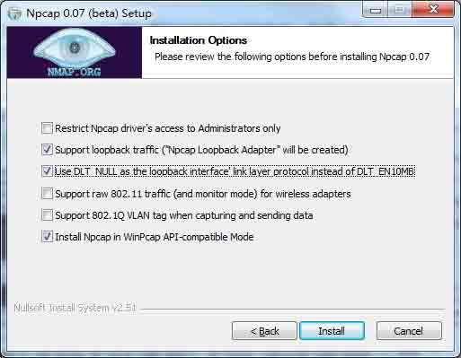

## Windows ##
下载安装包

	https://www.wireshark.org/
	https://2.na.dl.wireshark.org/win64/Wireshark-win64-2.0.4.exe
安装时不要选WinPcap，装另一个[https://github.com/nmap/npcap](https://github.com/nmap/npcap "npcap") 配合这个可以抓包locahost(127.0.0.1)

## Linux ##
安装依赖包

	yum install bison flex byacc glib2-devel libpcap-devel
下载源码包

	wget https://2.na.dl.wireshark.org/src/wireshark-2.0.4.tar.bz2

解压编译

	tart -xvjf wireshark-2.0.4.tar.bz2
	cd wireshark*
	./configure --prefix=/data/apps/wireshark --disable-wireshark --disable-editcap --disable-capinfos --disable-mergecap --disable-text2pcap --disable-dftest --disable-randpkt --disable-rawshark

使用实例
-------

打印当前http请求的url

	tshark -s 512 -i eth1 -n -f 'tcp dst port 80' -Y 'http.host and http.request.uri' -T fields -e http.host -e http.request.uri -l | tr -d '\t'

打印当前sql语句（127.0.0.1网卡抓不到locahost包）

	tshark -s 512 -i lo -n -f 'tcp dst port 3306' -Y 'mysql.query' -T fields -e mysql.query
	
	Running as user "root" and group "root". This could be dangerous.
	Capturing on 'Loopback'
	
	select @@version_comment limit 1
	show databases
	SET NAMES 'utf8'
	SELECT * FROM article WHERE hot='1'

附：
libpcap

	http://www.tcpdump.org/release/libpcap-1.7.4.tar.gz
如果手动安装libpcap,需要指定安装目录

	 --with-libcap=/data/apps/libs

Npcap

[http://bijian1013.iteye.com/blog/2299856](http://bijian1013.iteye.com/blog/2299856 "Npcap代替WinPcap")